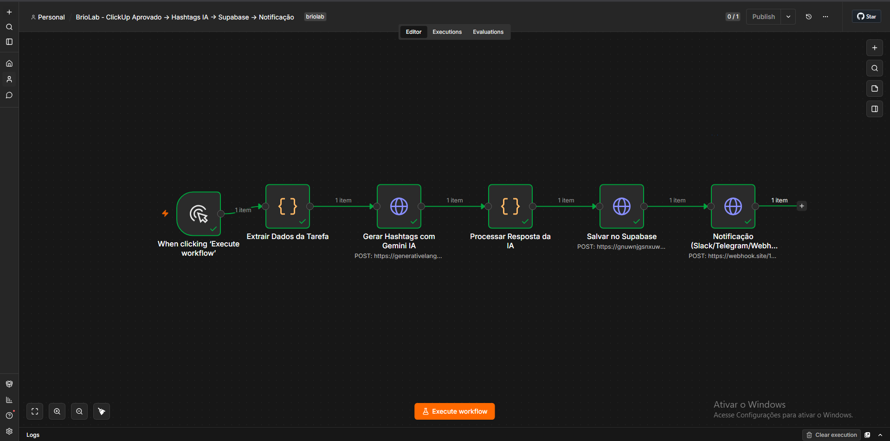
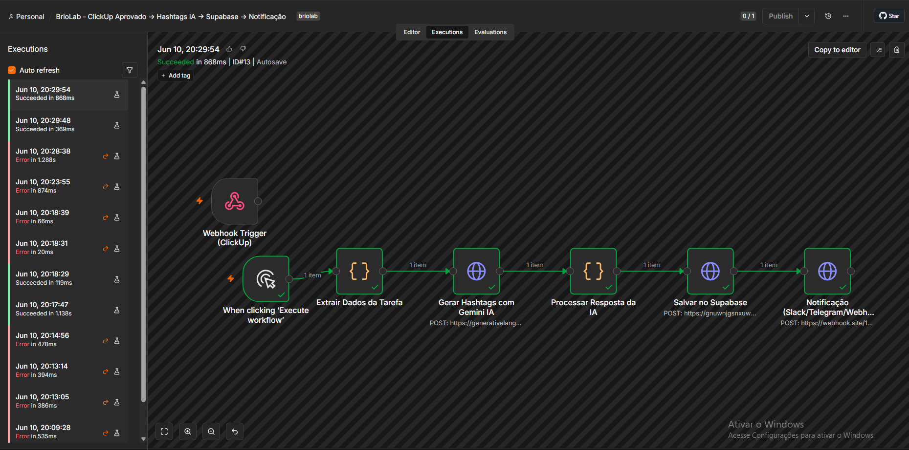
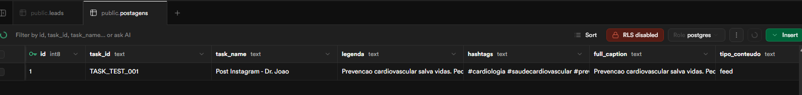

# Desafio Técnico — BrioLab

Automação & IA | Junho 2026

---

## Estrutura do repositório

```
/
├── n8n/
│   ├── workflow.json              # Workflow N8N exportado (Desafio 1)
│   └── screenshots/
│       ├── 01.png                 # Canvas do workflow completo
│       ├── 02.png                 # Execução com sucesso (Executions)
│       └── 03.png                 # Registro inserido no Supabase
└── python/
    ├── main.py                    # Script principal (Desafio 2)
    ├── db.py                      # Camada de banco de dados
    ├── schema.sql                 # Schema SQL (PostgreSQL/Supabase)
    └── requirements.txt
```

---

## Desafio 1 — Orquestração com N8N

### Screenshots

**Canvas do workflow:**



**Execução bem-sucedida:**



**Registro no Supabase:**



---

### O que foi construído

Workflow com 6 nós em sequência:

| Nó | Tipo | Função |
|----|------|--------|
| Manual Trigger | `n8n-nodes-base.manualTrigger` | Disparo manual para teste (substitui webhook do ClickUp) |
| Extrair Dados da Tarefa | `n8n-nodes-base.code` | Retorna dados mockados da tarefa para alimentar o pipeline |
| Gerar Hashtags com Gemini IA | `n8n-nodes-base.httpRequest` | Chama a API do Google Gemini para gerar hashtags com base na legenda |
| Processar Resposta da IA | `n8n-nodes-base.code` | Extrai texto da resposta, adiciona `#` onde falta, faz fallback se a IA falhar |
| Salvar no Supabase | `n8n-nodes-base.httpRequest` | Insere registro na tabela `postagens` via REST API do Supabase |
| Notificação | `n8n-nodes-base.httpRequest` | Envia payload compatível com Slack/Discord para URL configurável |

---

### Pré-requisitos

- **Node.js** (qualquer versão moderna)
- **N8N** instalado globalmente:
  ```powershell
  npm install -g n8n
  ```
- Conta no **Google AI Studio** (gratuita): [aistudio.google.com](https://aistudio.google.com) → Get API Key
- Projeto no **Supabase** (gratuito): [supabase.com](https://supabase.com)

---

### Como importar e rodar

**1. Configure as variáveis de ambiente no terminal antes de iniciar o N8N:**

```powershell
# PowerShell
$env:GEMINI_API_KEY="sua_chave_aqui"
$env:SUPABASE_URL="https://xxxx.supabase.co"
$env:SUPABASE_ANON_KEY="sua_anon_key"
$env:NOTIFICATION_WEBHOOK_URL="https://webhook.site/seu-id"
n8n
```

> **Nota:** A versão Community do N8N não possui interface de variáveis de ambiente. As variáveis devem ser definidas no terminal antes de iniciar o processo.

**2.** Acesse `http://localhost:5678` e crie uma conta local

**3.** Menu lateral → **Workflows** → **+** → **Import from file** → selecione `n8n/workflow.json`

**4.** Os nós que usam variáveis de ambiente (`$env.GEMINI_API_KEY`, `$env.SUPABASE_URL`, etc.) lerão automaticamente os valores definidos no terminal. Caso prefira, edite cada nó e insira os valores diretamente nos campos URL/Header.

**5.** Clique em **Test workflow** para executar

---

### Variáveis de ambiente

| Variável | Descrição |
|----------|-----------|
| `GEMINI_API_KEY` | Chave da API do Google Gemini (formato `AQ.xxx`) |
| `SUPABASE_URL` | URL do projeto Supabase (ex: `https://xxxx.supabase.co`) |
| `SUPABASE_ANON_KEY` | Publishable/Anon key do Supabase |
| `NOTIFICATION_WEBHOOK_URL` | URL de webhook para notificações (webhook.site, Slack, Discord, etc.) |

---

### Modelo de IA utilizado

**Google Gemini 2.0 Flash Lite** (`gemini-2.0-flash-lite`) via API gratuita do Google AI Studio.

> Claude Pro (Anthropic) **não** inclui acesso à API — são produtos separados. O Gemini oferece tier gratuito completo para integração via API.

Endpoint utilizado:
```
POST https://generativelanguage.googleapis.com/v1beta/models/gemini-2.0-flash-lite:generateContent?key=API_KEY
```

---

### SQL para criar as tabelas no Supabase

Execute no **SQL Editor** do painel Supabase:

```sql
CREATE TABLE IF NOT EXISTS leads (
    id                BIGSERIAL    PRIMARY KEY,
    nome              TEXT         NOT NULL,
    telefone          TEXT         NOT NULL,
    email             TEXT         NOT NULL UNIQUE,
    especialidade     TEXT         NOT NULL,
    principal_desafio TEXT         NOT NULL,
    clickup_task_id   TEXT,
    created_at        TIMESTAMPTZ  NOT NULL DEFAULT NOW()
);

CREATE TABLE IF NOT EXISTS postagens (
    id              BIGSERIAL    PRIMARY KEY,
    task_id         TEXT         NOT NULL,
    task_name       TEXT         NOT NULL,
    legenda         TEXT,
    hashtags        TEXT,
    full_caption    TEXT,
    tipo_conteudo   TEXT,
    data_postagem   DATE,
    cliente         TEXT,
    status          TEXT         DEFAULT 'aprovado',
    ia_model        TEXT,
    ia_tokens_used  INTEGER,
    processed_at    TIMESTAMPTZ,
    created_at      TIMESTAMPTZ  DEFAULT NOW()
);

-- Necessário para inserções via anon key sem autenticação
ALTER TABLE leads DISABLE ROW LEVEL SECURITY;
ALTER TABLE postagens DISABLE ROW LEVEL SECURITY;
```

---

### O que simulei

- **ClickUp Trigger**: substituído por Manual Trigger com dados mockados diretamente no nó de código. Em produção, configurar o ClickUp para enviar POST webhook quando status mudar para "aprovado" e restaurar o nó `Webhook Trigger` original.
- **Notificação**: aponta para `NOTIFICATION_WEBHOOK_URL`. Testado com webhook.site. Compatível com Slack e Discord sem alteração no payload.

---

## Desafio 2 — Backend Python

### Arquitetura

| Arquivo | Responsabilidade |
|---------|-----------------|
| `main.py` | Validação, normalização, orquestração do pipeline e ClickUp |
| `db.py` | Camada de banco de dados — troca de backend sem alterar `main.py` |
| `schema.sql` | Schema SQL explícito, compatível com PostgreSQL/Supabase |

### Etapa 1 — Validação

- Verifica campos obrigatórios: `nome`, `telefone`, `email`, `especialidade`, `principal_desafio`
- Coleta **todos** os erros antes de retornar (fail-all, não fail-fast)
- Formata telefone para `(XX) XXXXX-XXXX` ou `(XX) XXXX-XXXX`, aceitando DDI `+55`, parênteses, traços e espaços
- Normaliza e-mail (lowercase + strip) e valida formato com regex

### Etapa 2 — Banco de dados

O backend é selecionado pela variável `DATABASE_BACKEND`:

| Valor | Quando usar | Dependência |
|-------|-------------|-------------|
| `sqlite` (padrão) | Desenvolvimento local, zero setup | nenhuma (stdlib) |
| `supabase` | Produção | `pip install supabase` |
| `postgres` | PostgreSQL próprio | `pip install psycopg2-binary` |

A interface pública de `db.py` (`insert_lead`, `update_task_id`) é idêntica em todos os backends.

### Etapa 3 — ClickUp (simulado)

- Monta o payload completo do `POST /api/v2/list/{list_id}/task`
- Imprime com logs estruturados (endpoint, headers, body)
- Retorna `task_id` simulado e vincula ao lead no banco
- Se a criação de tarefa falhar, o lead já salvo **não é cancelado**

### Como rodar

```powershell
cd python

# SQLite local (sem dependências extras)
python main.py

# Com Supabase:
# pip install supabase
# $env:DATABASE_BACKEND="supabase"
# $env:SUPABASE_URL="https://xxxx.supabase.co"
# $env:SUPABASE_KEY="sua_anon_key"
# python main.py
```

Para ativar o ClickUp real, defina as variáveis e descomente as linhas indicadas em `main.py`:

```powershell
$env:CLICKUP_API_TOKEN="pk_xxxx"
$env:CLICKUP_LIST_ID="90123456"
$env:CLICKUP_ASSIGNEE_ID="12345678"
```

---

## O que faria diferente com mais tempo

### Desafio 1 — N8N

- **Tratamento de erro por nó**: adicionar nós `Error Trigger` para capturar falhas do Supabase ou da IA e notificar com contexto de qual etapa falhou
- **Retry com backoff**: configurar 3 tentativas com intervalo crescente na chamada à IA
- **Idempotência**: verificar se `task_id` já existe antes de inserir, evitando duplicatas em reentregas do webhook
- **Webhook real do ClickUp**: restaurar o nó `Webhook Trigger` com a URL pública e configurar o ClickUp para disparar automaticamente na mudança de status

### Desafio 2 — Python

- **FastAPI**: transformar o script em API REST com endpoint `POST /leads`, documentação OpenAPI e validação Pydantic
- **Testes automatizados**: unit tests para `_formatar_telefone` e `_normalizar_email`, integração com banco em memória
- **Fila assíncrona para o ClickUp**: mover criação de tarefa para background (Celery, ARQ) para não bloquear a resposta
- **Variável de ambiente para DB_PATH**: facilitar testes e deploy em diferentes ambientes

---

*Desenvolvido como parte do processo seletivo BrioLab — Junho 2026*
