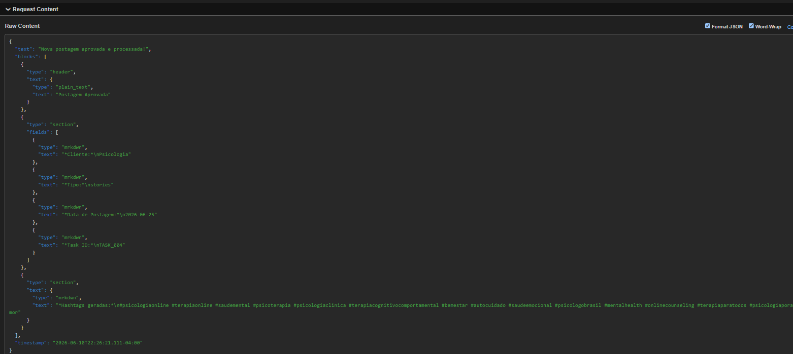
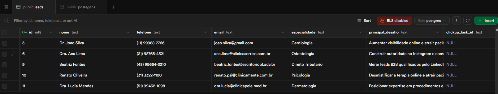

# Desafio Técnico — BrioLab

Automação & IA | Junho 2026

---

## Estrutura do repositório

```
/
├── n8n/
│   ├── workflow.json              # Workflow N8N exportado
│   └── screenshots/
│       ├── 01.png                 # Canvas do workflow completo
│       ├── 02.png                 # Histórico de execuções (painel Executions)
│       ├── 03.png                 # Tabela postagens no Supabase (Desafio 1)
│       ├── 04.png                 # Tabela leads no Supabase (Desafio 2)
│       └── 05.png                 # Notificação recebida no webhook.site
└── python/
    ├── main.py                    # Script principal
    ├── db.py                      # Camada de banco de dados
    ├── schema.sql                 # Schema SQL completo (leads + postagens)
    └── requirements.txt
```

---

## Desafio 1 — Orquestração com N8N

### Screenshots

**Canvas do workflow:**


**Histórico de execuções (painel Executions):**


**Tabela `postagens` no Supabase — registros gerados pelos 4 cenários de teste:**


**Notificação recebida no webhook.site — payload Block Kit com hashtags geradas pela IA:**



---

### O fluxo

```
Manual Trigger
    → Extrair Dados da Tarefa   (Code node — 4 cenários prontos para teste)
    → Gerar Hashtags com Gemini (HTTP Request → Gemini 2.5 Flash Lite)
    → Processar Resposta da IA  (Code node — normaliza + fallback)
    → Salvar no Supabase        (HTTP Request → REST API Supabase)
    → Notificação               (HTTP Request → webhook compatível Slack)
```

Os dados fluem de ponta a ponta: a legenda entra no primeiro nó e a notificação final carrega as hashtags geradas, o cliente, a data e o task_id — tudo rastreável.

### Cenários de teste disponíveis

O nó **"Extrair Dados da Tarefa"** contém 4 cenários prontos. Para trocar, altere `CENARIO_ATIVO` no código do nó:

| Cenário | Especialidade | Tipo de conteúdo |
|---------|--------------|-----------------|
| `cardiologia_feed` | Cardiologia | Feed |
| `odontologia_reels` | Odontologia | Reels |
| `advocacia_carrossel` | Direito Tributário | Carrossel |
| `psicologia_stories` | Psicologia | Stories |

---

### Decisões técnicas

**Por que Manual Trigger?**

O desafio permite explicitamente: *"Se não tiver conta no ClickUp, use um webhook manual como trigger e simule o payload."* O nó "Extrair Dados" contém 4 cenários prontos (cardiologia, odontologia, advocacia, psicologia) — basta trocar `CENARIO_ATIVO` para testar cada um. O comentário no mesmo nó mostra o código exato para quando o Webhook Trigger real do ClickUp estiver conectado.

---

**Por que Google Gemini em vez de Claude ou GPT?**

Contexto: o plano Pro da Anthropic (Claude) não inclui acesso à API — são produtos separados. O GPT não oferece tier gratuito com volume útil para automações.

Tentativa: tentei usar a API da Anthropic primeiro. Descobri durante a implementação que Claude Pro não é equivalente a uma API key.

Resultado: Google Gemini 2.5 Flash Lite via Google AI Studio — gratuito, sem cartão de crédito, com suporte completo a `generateContent`. O modelo é mais que suficiente para geração de hashtags.

Próximo passo: em produção, o provedor de IA poderia ser configurável via variável de ambiente (`AI_PROVIDER=gemini|openai|anthropic`), trocando apenas o nó HTTP Request.

---

**Por que `keypair` body no nó Supabase em vez de JSON raw?**

Contexto: o campo `full_caption` contém quebras de linha (`\n`). Quando interpolado em um template JSON manual (`"{{ $json.full_caption }}"`), o N8N não escapa o valor, gerando JSON inválido.

Tentativa: tentei com JSON body e o N8N retornou erro "Bad control character in string at position 544". Diagnosticado pelo erro que apontava exatamente para o campo com newline.

Resultado: modo "Using Fields Below" (`keypair`) — o N8N serializa cada campo individualmente e faz o escape automaticamente.

---

**Por que o prompt tem seção PROIBIDO?**

Prompts sem restrições explícitas podem gerar alucinações (hashtags inventadas), vazar dados do contexto (a legenda pode conter informações do cliente), ou produzir conteúdo que viola as diretrizes do Instagram ou regulamentos do CFM/CFO. O prompt inclui: lista de proibições, regras de formato obrigatório, e instrução de qualidade (mix de alta/baixa competição) para resultado mais útil. A `temperature` foi reduzida de 0.7 para 0.4 — menos criatividade, mais previsibilidade e consistência no formato de saída.

---

**Por que o fallback de hashtags no nó "Processar Resposta da IA"?**

A chamada à IA pode falhar por rate limit (o free tier tem 15-30 RPM), timeout ou erro de rede. Se o fluxo parar aqui, a postagem ficaria sem hashtags e sem notificação. O fallback garante que o fluxo sempre chega até o Supabase e a notificação — mesmo que com hashtags genéricas. O log registra quando o fallback foi ativado.

---

### Como rodar

**Pré-requisitos:**
- Node.js instalado
- `npm install -g n8n`
- Conta gratuita no Google AI Studio: [aistudio.google.com](https://aistudio.google.com) → Get API key
- Projeto gratuito no Supabase: [supabase.com](https://supabase.com)

**1. Criar as tabelas no Supabase** — SQL Editor → executar `python/schema.sql` completo

**2. Iniciar o N8N com as variáveis de ambiente:**

```powershell
# PowerShell
$env:GEMINI_API_KEY="sua_chave_gemini"
$env:SUPABASE_URL="https://xxxx.supabase.co"
$env:SUPABASE_ANON_KEY="sua_publishable_key"
$env:NOTIFICATION_WEBHOOK_URL="https://webhook.site/seu-id"
n8n
```

> A versão Community do N8N não tem interface de variáveis de ambiente. As variáveis precisam estar no ambiente do processo antes de iniciar o N8N — o `$env.VARIABLE` no workflow as lê automaticamente.

**3.** Acessar `http://localhost:5678` → criar conta local

**4.** Workflows → + → Import from file → `n8n/workflow.json`

**5.** Clicar em **Test workflow** — todos os 6 nós devem ficar verdes

---

### Variáveis de ambiente

| Variável | Descrição |
|----------|-----------|
| `GEMINI_API_KEY` | Google AI Studio API key (formato `AQ.xxx`) |
| `SUPABASE_URL` | URL do projeto (`https://xxxx.supabase.co`) |
| `SUPABASE_ANON_KEY` | Publishable key do Supabase |
| `NOTIFICATION_WEBHOOK_URL` | Endpoint de notificação (webhook.site, Slack, Discord) |

---

## Desafio 2 — Backend Python

### Screenshots

**Tabela `leads` no Supabase — registros salvos pelos 5 casos válidos do script:**



---

### O fluxo

```
JSON de entrada
    → validar()          ← coleta TODOS os erros antes de retornar
    → db.insert_lead()   ← backend transparente: SQLite / Supabase / PostgreSQL
    → criar_tarefa_clickup()  ← simulado com payload documentado
    → retorna resultado estruturado com lead_id e clickup_task_id
```

### Decisões técnicas

**Por que fail-all validation em vez de fail-fast?**

Contexto: formulários web que retornam um erro de cada vez frustram o usuário e aumentam o tempo de preenchimento.

Decisão: a função `validar()` acumula todos os erros em uma lista antes de levantar `ValidationError`. Com 3 campos inválidos, o usuário recebe os 3 erros de uma vez.

Tradeoff: ligeiramente mais código, mas o comportamento é muito mais usável. Em produção com FastAPI + Pydantic, isso vem de graça.

---

**Por que a camada `db.py` em vez de escrever SQLite diretamente no `main.py`?**

Contexto: o desafio menciona Supabase, SQLite e PostgreSQL como opções. A infraestrutura da Brio usa Supabase — mas rodar o script localmente não deveria exigir conta Supabase.

Decisão: `db.py` expõe apenas duas funções (`insert_lead`, `update_task_id`). O `main.py` não importa `sqlite3`, `supabase` ou `psycopg2` — não sabe qual backend está ativo. A troca é feita por variável de ambiente:

```
DATABASE_BACKEND=sqlite    → zero dependências, roda em qualquer máquina
DATABASE_BACKEND=supabase  → pip install supabase
DATABASE_BACKEND=postgres  → pip install psycopg2-binary
```

Próximo passo: em produção, o `db.py` poderia virar uma classe abstrata (`LeadRepository`) com implementações separadas — mais testável e extensível.

---

**Por que o ClickUp é simulado?**

Contexto: a API do ClickUp requer um workspace real com list_id e assignee_id específicos. Não é viável simular credenciais válidas.

Decisão: o payload completo é montado e logado — incluindo endpoint, headers (com `[REDACTED]`) e body formatado. Quem for integrar em produção pode descomentar 3 linhas no código.

Importante: se o ClickUp falhar, o lead já está salvo no banco. O fluxo não faz rollback — um lead sem task_id é recuperável; um lead perdido não é.

---

**Por que o `nome` recebe `.title()` na validação?**

Dados digitados em formulários chegam em qualquer capitalização ("dr. JOAO", "dra. ana lima"). `.title()` normaliza para "Dr. Joao" antes de salvar. Não é sanitização cosmética — é consistência para buscas e exibição.

---

### Como rodar

```powershell
cd python

# SQLite local — sem dependências extras
python main.py

# Com Supabase (executar schema.sql no Supabase SQL Editor antes):
# pip install supabase
# $env:DATABASE_BACKEND="supabase"
# $env:SUPABASE_URL="https://xxxx.supabase.co"
# $env:SUPABASE_KEY="sua_anon_key"
# python main.py
```

O script roda 9 casos de teste automaticamente:

| # | Tipo | Descrição |
|---|------|-----------|
| 1–5 | Válidos | Cardiologia, Odontologia, Advocacia, Psicologia, Dermatologia — diferentes formatos de telefone e e-mail |
| 6 | Falha esperada | Múltiplos campos obrigatórios ausentes |
| 7 | Falha esperada | Telefone com dígitos insuficientes |
| 8 | Falha esperada | E-mail malformado (sem domínio) |
| 9 | Falha esperada | Telefone e e-mail inválidos simultaneamente (fail-all) |

---

## O que faria diferente com mais tempo

### Desafio 1 — N8N

**Idempotência no webhook do ClickUp**

O ClickUp pode reenviar o mesmo webhook por falha de rede. Hoje, cada execução insere uma nova linha em `postagens` com o mesmo `task_id`. Em produção, o nó Supabase deveria usar `upsert` (header `Prefer: resolution=merge-duplicates`) e a tabela teria uma constraint `UNIQUE(task_id)`. Sem isso, o cliente pode receber notificações duplicadas.

**Retry com backoff no nó Gemini**

O free tier do Gemini tem limite de 15 RPM. Em pico de aprovações simultâneas, o nó vai falhar com 429. O N8N HTTP Request suporta retry nativo — configuraria 3 tentativas com intervalo exponencial (1s, 4s, 16s) antes de acionar o fallback de hashtags.

**Segurança no Supabase (RLS)**

Desabilitei o Row Level Security para simplificar o desenvolvimento. Em produção, usaria a `service_role key` no servidor (nunca exposta no cliente) com RLS habilitado — e criaria policies para permitir apenas `INSERT` na tabela `postagens` via essa key.

**Webhook Trigger + validação de status**

Hoje confio que o payload sempre chega com `status: aprovado`. O ClickUp pode chamar o webhook para outros eventos. Adicionaria um nó `IF` logo após o trigger para verificar `{{ $json.task.status.status === 'aprovado' }}` antes de continuar o fluxo.

---

### Desafio 2 — Python

**FastAPI com validação Pydantic**

Transformar o script em `POST /leads` com modelo Pydantic: tipos fortes, validação automática, documentação OpenAPI gerada. A lógica de `validar()` e `db.py` seria aproveitada sem mudança.

**Testes automatizados**

Os 5 casos em `CASOS` são testes manuais. Migraria para pytest com:
- Unit tests para `_formatar_telefone` e `_normalizar_email` (edge cases: +55, DDI estrangeiro, emails com subdomínio)
- Integration test com SQLite `:memory:` para o pipeline completo
- Mock para o ClickUp (já que é simulado, testar que o payload gerado tem os campos certos)

**Fila para o ClickUp**

A criação de tarefa no ClickUp é a etapa mais frágil: API externa, timeout, rate limit. Em produção, moveria para uma fila de background (Celery + Redis ou ARQ). O endpoint responderia imediatamente com `202 Accepted` e o ClickUp seria chamado de forma assíncrona — com retry automático em caso de falha.

**Tratamento de e-mails internacionais**

O regex atual (`[a-z0-9._%+\-]+@...`) rejeita e-mails com caracteres Unicode válidos (ex: `ação@empresa.com.br`). Em produção, usaria `email-validator` (pypi) que implementa RFC 5322 completo.

---

*Desenvolvido como parte do processo seletivo BrioLab — Junho 2026*
